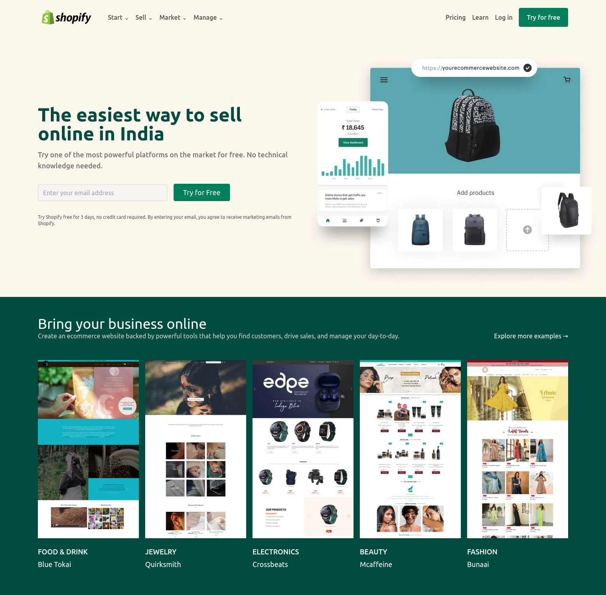
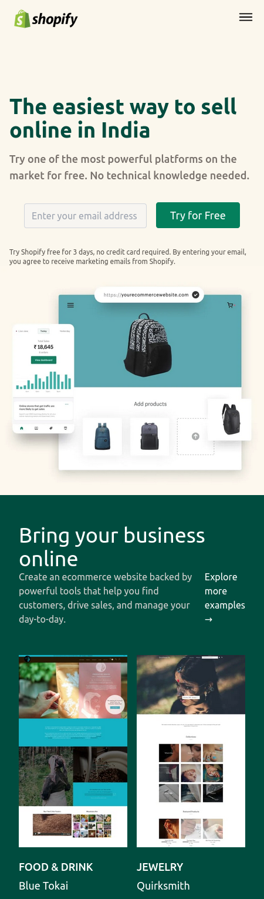

# PROJECT - Shopify CLONE

This is a clone of Shopify website, a tailwind project given by Ineuron.

## Table of contents

- [Overview](#overview)
  - [Screenshot](#screenshot)
  - [Links](#links)
- [My process](#my-process)
  - [Built with](#built-with)
  - [Time required](#time-required)
  - [What I learned](#continues-development)
  - [Useful resources](#useful-resources)
- [Author](#author)
- [Acknowledgments](#acknowledgments)

## Overview

### Screenshot





### Links

- Code File URL: [github.com](https://github.com/Jyotimoykathar/shopify_clone)
- Live Site URL: [netlify.app](https://rode-website-clone-tailwindcss.netlify.app/)

## My process

### Built with

- Semantic HTML5 markup
- Tailwind Css

### Time required

2 days required to understand more the tailwind doc and apply till completion.

### What I learned

This is the customize color design code snippet using tailwind css.

```js
<script>
      tailwind.config = {
        theme: {
          extend: {
            colors: {
              lightBrown: "#FBF7ED",
              green: "#047F5C",
              darkGreen: "#004C3F",
              greenShade: "#002E25",
              lightGreen: "#F3FCF4",
            },
          },
        },
      };
    </script>
```

### Continued development

I still have a lot to learn about tailwind css library and implement it.
Animation and JS need to be added to make the page more interactive and beautiful.

### Useful resources

- [TAILWIND](https://tailwindcss.com/docs/installation) - This tailwind doc. was very helpful while creating the entire project.
- [ION ICONS](https://ionic.io/ionicons) - This is an amazing website with open source icons that helps to add icons easily to your webpages.

## Author

- Github page- [Jyotimoykathar](https://github.com/Jyotimoykathar/)

## Acknowledgments

Special Thanks to Ineuron team for the Project to learn and improve my Tailwind css framework skills .
